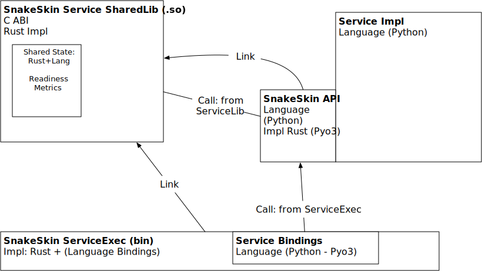

# Actions to test rusty snakeskin

* [x] Create a python library
* [x] Create a rust program
* [x] Call elements of the python library from rust
* [x] Call async functions of the python library
* [ ] Call the Rust API from python
    * [ ] Create a API definition of the Rust API in python
    * [ ] Send API object from Rust into python when constructing a python object
    * [ ] Call methods on that object to hit the rust APIs

# Architecture Diagrams

## ServiceLib

The only place where state can be shared with both the rust runtime and python runtime to create a single point of knowledge. This is necessary for readyness/liveness data.

## ServiceExec
This is the service entry point for the runtime exec. It links to the ServiceLib.
It could link/call to the Service.... But not clear if this is the correct approach. Perhaps it is better to have the ServiceLib perform that operation.

## Service
This contains the functional logic of the service. It is called by ..... (ServiceLib or ServiceExec  --- Not sure which).

## Questions
1. Should we call Service from ServiceExec or ServiceLib
If we call Service from ServiceLib then majority of logic is captured into ServiceLib. ServiceExec becomes a very small shim layer into ServiceLib.
 * Downside every update to the implementation needs to be done in the ServiceLib
 * Alternative If we call Service from ServiceExec we make the ServiceLib more complex (exposing Rust API as C-ABI).
Upside: we can carry some service specific config changes into the ServiceExec layer makeing the coupling less tight.

# Problems

How can i load the rust program (binary -- probably static) and have it accessible from python whilst sharing the same library object code as the rust binary.

Suggestion create a single shared object library that is available to both python and rust.

When calling an embedded python from a python venv the embedded python is not expected to work out the PYTHONPATH in the same way that the interpreter does. Therefore it is necessary to provide PYTHONPATH to the embedded python so that it can correctly setup the sys.path (needed to find modules)
Added notes here to describe: https://github.com/PyO3/pyo3/issues/1741

## Linking to C Library
https://coderedirect.com/questions/163022/linking-rust-application-with-a-dynamic-library-not-in-the-runtime-linker-search

also consider

https://stackoverflow.com/questions/61071884/how-to-call-a-shared-library-in-rust
http://blog.asleson.org/2021/02/23/how-to-writing-a-c-shared-library-in-rust/

* Add a C-Library to the build
This is done and works nicely as part of the build and linkage steps
Needs some special support using the build.rs file. It may be possible to replace this with directives for the extern declaration.

## Rename of lib generated through python building process
The file is directly created and not prepended with lib. This means it cannot be loaded by linker as linker is looking for a library starting wtih lib*.so

## What is best approach

Do we split the rust library into two parts. One that stays as rust and then layer a very light python layer on top to provide the relevant features.
OR do we make a single library (using python) that does everything.

Thinking ahead... python is just an example of a single language binding we require therefore the library itself should remain neutral to the binding to python.
This implies to keep the python library very light and have it access the rust library.
So the trick will be to pull the relevant rust API out into a seperate rust library build and then use that to generate a .so file. Then to create interfaces in rust to that library allowing it to be utillised by both the python API and the rust API.
